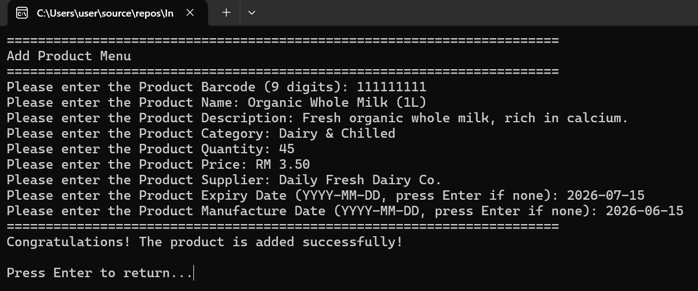
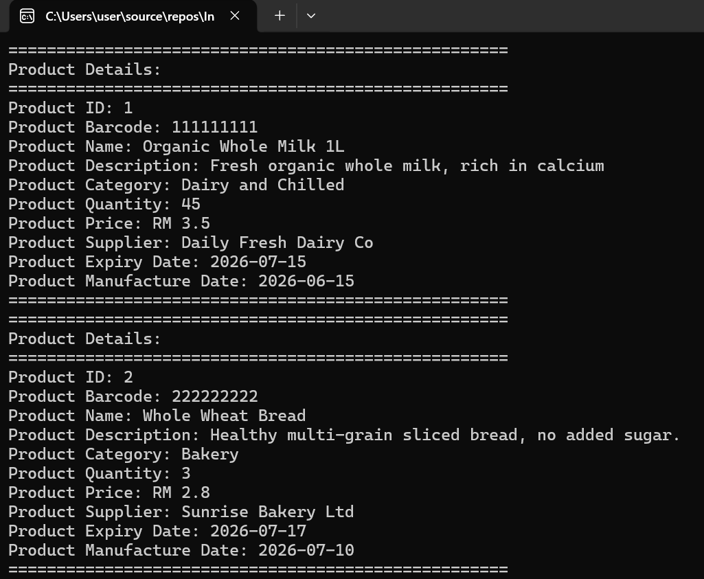
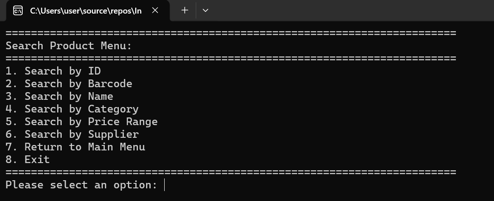
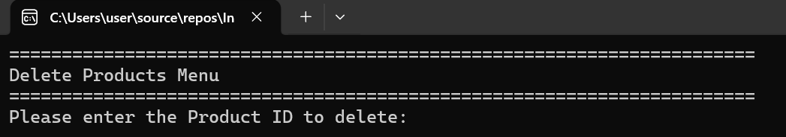

# IoT-Enabled Smart Inventory Management System with RFID, Database, and FPGA-Based Stock Monitoring

## Description

A C++ based smart inventory management system developed using Object-Oriented Programming (OOP) principles.

The system provides complete product management functionalities with MySQL database integration, inventory dashboard monitoring, and report generation. It also supports RFID UID management and prepares future integration with IoT devices such as ESP32 for real-time inventory monitoring.

---

# Features

## Product Management
✔ Add Product  
✔ Display Product  
✔ Update Product Information  
✔ Delete Product  

## Product Search
✔ Search by ID  
✔ Search by Barcode  
✔ Search by Name  
✔ Search by Category  
✔ Search by Price Range  
✔ Search by Supplier  

## Product Organization
✔ Sort Products
   - Sort by ID
   - Sort by Name
   - Sort by Category
   - Sort by Quantity
   - Sort by Price
   - Sort by Expiry Date

## Inventory Monitoring
✔ Product Status Monitoring  
✔ Low Stock Detection  
✔ Out of Stock Detection  
✔ Inventory Dashboard Statistics  
   - Total Products
   - Total Quantity
   - Inventory Value
   - RFID Registration Rate

## Database Integration
✔ MySQL Database Storage  
✔ CRUD Database Operations  
✔ Database Synchronization  
✔ Transaction Handling using Commit/Rollback  
✔ Database Connection Status Monitoring

## Reporting
✔ CSV Inventory Report Export  
✔ TXT Inventory Report Export

## RFID Support
✔ RFID UID Storage  
✔ RFID UID Update  
✔ RFID-ready Product Identification

---

# Technologies

## Programming Language
- C++

## Concepts
- Object-Oriented Programming
- File Handling
- Database Management
- Data Validation
- STL (vector, algorithm)
- Exception Handling

## Database
- MySQL
- MySQL Connector/C++

## Hardware Preparation
- ESP32 (Future Integration)
- MFRC522 RFID Module (Future Integration)
- FPGA Low-Stock Alert System (Future Integration)

## Tools
- Visual Studio
- MySQL Workbench
- Git/GitHub

---

# Screenshots

## Version 1.0 - C++ Inventory Management System

### Main Menu

### Add Product

### Display Products

### Search Product

### Sort Products

### Update Product

### Delete Product

### Product Status Monitoring

---

# Version 2.0 - MySQL Database Integration & Smart Dashboard

### Database Connection

### Main Menu(Updated Version)

### Inventory Dashboard

### Database Product Table After Update/Delete

### Database Structure

### RFID UID Support

### Refresh Function

### Export Report

### CSV/TXT Report

---

# Version History

## v1.0
Initial C++ Inventory Management System.

Implemented:
- Product Management
- Search and Sorting Functions
- Input Validation
- File-based Data Storage using `products.txt`
- Product Status Monitoring

---

## v2.0
MySQL Database Integration and Smart Inventory Dashboard.

Implemented:
- MySQL database storage
- CRUD database operations
- Database synchronization
- Inventory dashboard
- Database connection monitoring
- CSV/TXT report export
- RFID UID support

---

## v3.0 (Planned)
IoT Hardware Integration.

Planned:
- ESP32 integration
- MFRC522 RFID module communication
- Wireless product identification
- Real-time inventory synchronization

---

## v4.0 (Planned)
FPGA-Based Smart Stock Monitoring.

Planned:
- FPGA low-stock alert system
- Hardware-based inventory monitoring
- Real-time stock warning mechanism
